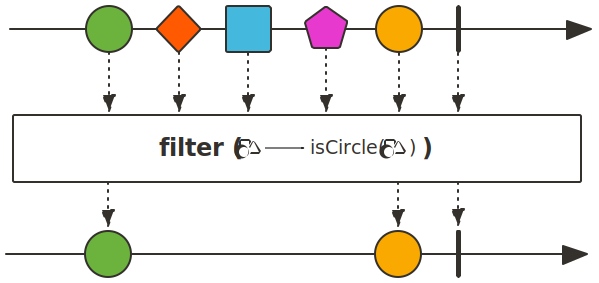
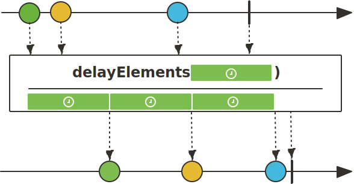
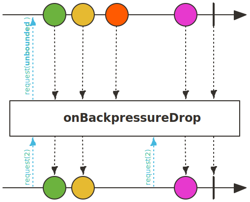
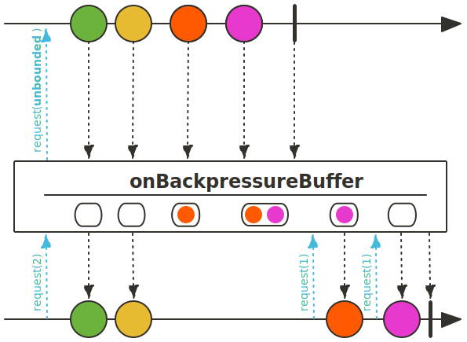
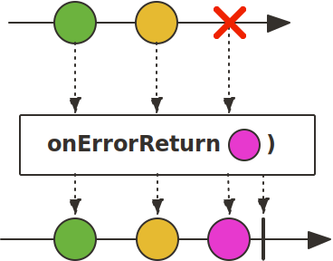
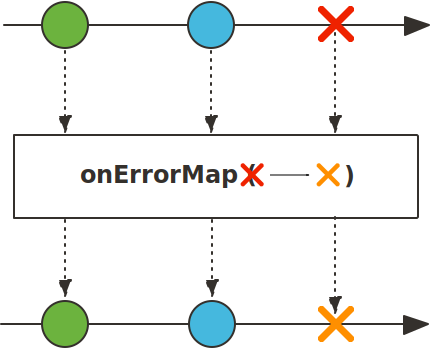
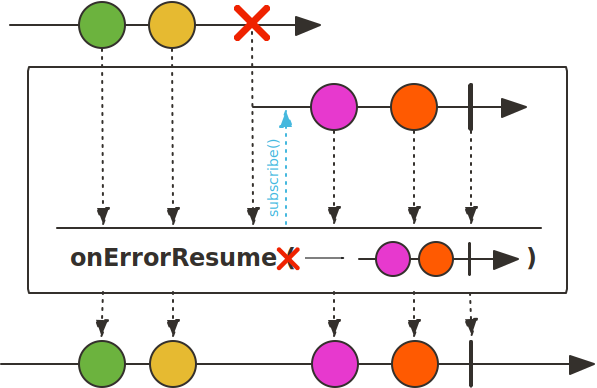
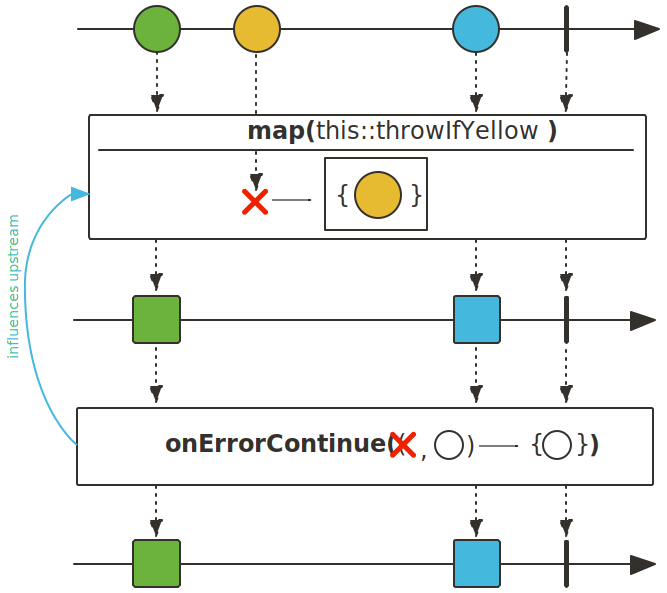

# talk-intro-reactive-java
Este repositorio está asociado a la charla introductoria a la programación reactiva en Java para el Chapter Backend de ADL.


## Contenido

- [Introducción](#Introducción)
- [Motivación](#Motivación)
- [Contexto](#Contexto)
- [Tutorial](#Tutorial)
- [Recursos adicionales](#Recursos-adicionales)
- [Referencias](#Referencias)

## 1. Introducción

En este repositorio hay un pequeño demo en Java útil para introducirse a los conceptos básicos de la programación reactiva, particularmente en Java.

- La presentación la puede encontrar [aquí](https://drive.google.com/file/d/11skHDerB4V3TzXS23E6nz1hK64JjUfts/view?usp=sharing).
- El video de la presentación lo puede encontrar aquí: [TODO]()

La charla tiene una duración de ~50 min.

  - Motivación y contexto: ~25 min
  - Conceptos básicos: ~20 min
  - Revisión del repo: ~5 min
  - Quiz: ~5 min (solo presentación en vivo)

- En este repo encontrará:
  - Instalación y configuración del proyecto
  - Como ejecutar los ejemplos
  - Documentación
  - Laboratorio prueba de carga Reactivo vs No Reactivo


## 2. Motivación

Revisar la presentación.

## 3. Contexto

Revisar la presentación.

## 4. Tutorial

Los conceptos que se revisarán en esta sección son transversales a la mayoria de bibliotecas que proveen capacidades y/o habilitan el uso de _Streams_ reactivos. 

Una funcionalidad interesantes es la de poder "encadenar" métodos, permitiendo así la conversión compleja de de flujos de datos [1].

### 4.1 Instalación y configuración

Para este tutorial se recomienda tener instalado:


- Java 8: se trabajará con Java 8+ por lo tanto es esencial tenerlo instalado. Si requiere tener varias versiones del JDK en su maquina puede usar [JENV](https://github.com/jenv/jenv).

```sh
$ java -version
java version "1.8.0_101"
Java(TM) SE Runtime Environment (build 1.8.0_101-b13)
Java HotSpot(TM) 64-Bit Server VM (build 25.101-b13, mixed mode)
```

- Un IDE para Java. Se recomienda IntelliJ IDEA.

#### Pasos para ejecutar este proyecto:

- Clone este proyecto (si todavia no lo ha hecho)

```sh
git clone https://github.com/alejandro56664-adl/talk-intro-reactive-java.git
```

- Importe el proyecto ```demo_reactor```en InteliJ IDEA como un proyecto tipo Gradle.

- Ejecute la prueba ```ReactorTest.java```


### 4.2 Revisión de los componentes básicos

Ahora vamos a revisar los operadores, las porciones de código que se describe en esta sección pertenecen al archivo ```BasicsTest.java```.

 **Flux (Flujo)**

```Flux <T>``` es el principal punto de entrada para los flujos reactivos de _Reactor_ y es similar al ```Observable``` de _RxJava_.

 ```Mono <T>``` es como un ```Flux``` pero de cero a un elemento. Tanto ```Mono``` como ```Flux``` implementan 
 ```org.reactivestreams.Publisher```.

Al igual que en RxJava, Reactor usa _Schedulers_ para decidir qué hilo ejecutar.

Se crea un rango y se publica en ```Schedulers.parallel()``` que proporciona una caché de subprocesos para ejecutar en paralelo:

```java
Flux.range(1, 100)
    .publishOn(Schedulers.parallel())
    .subscribe(v -> System.out.println(v));
```

Para manejar erroes se usan los siguientes métodos

- ```onErrorResume(Function)``` : Acepta la excepción y devuelve un publicador diferente como flujo alternativo o secundario.

- ```onErrorMap(Function)``` : acepta la excepción y le permite modificarla o devolver una excepción completamente nueva si lo prefiere.

- ```onErrorReturn(T)``` : Proporciona un valor predeterminado para usar cuando surge un error.

- ```doOnError(Consumer<? super Throwable>)``` : Permite manejar el error sin afectar la transmisión subyacente de ninguna manera.

 **Mono (Único)**

Es como el ```Flux```, pero solo para uno o cero elementos. Es la versión reactiva de la clase ```Optional``` . 

Métodos:

- ```justOrEmpty (T)```: toma un valor que acepta valores NULL y se convierte en Mono. Si es nulo, el resultado es el mismo que ```Mono.empty()```.

- ```justOrEmpty (Optional)```: Toma un Optional y se convierte en Mono directamente.

A diferencia del ```Optional``` de Java, ```Mono``` puede manejar errores de la misma manera que un ```Flux``` (usando onErrorResume, onErrorMap u onErrorReturn).

Ejemplos: 

```java
Flux<String> flux1 = Flux.just("a", "b", "foobar"); 
List<String> iterable = Arrays.asList("a", "b", "foobar");
Flux<String> flux2 = Flux.fromIterable(iterable);
Flux<Integer> numbers = Flux.range(1, 64);

Mono<String> noData = Mono.empty();
Mono<String> data = Mono.just("foo"); 
```

**Flux API**

La API principal maneja los siguientes conceptos:

- **Value**: se refiere a los valores generados por el Publicador/Observable.

- **Completion**: Se refiere a una terminación normal del flujo.

- **Error**: Se refiere a una terminación erronea del flujo.

Esto lleva la existencia de los siguientes tipos de flujo:

- **Infinite stream**: Un Publicador solo genera eventos con Valores (Value) y no eventos terminales (completion and error).

- **Infinite empty stream**: Un flujo que no genera ni valores ni eventos terminales.

- **Finite stream**: Un Publicador que genera N eventos y luego un evento terminal.

- **Empty stream**: Un Publicador que no genera eventos con valores, solo un evento terminal.

**Schedulers**

- ```Schedulers.immediate()``` : El hilo actual.

- ```Schedulers.single()``` : En un hilo único y reusable. Este método reusa el mismo hilo para todos los métodos que lo invoquen, hasta que el Scheduler sea desechado. 

- ```Schedulers.newSingle()``` : Crea un nuevo hilo cada vez que es usado.

- ```Schedulers.elastic()``` : Crea un _thread pool_ elastico. Crea nuevos _worker pools_ a medida que es necesario y reusa los hilos ociosos. Cuando los _Worker pools_ estan ociosos por mucho tiempo son desechados. Esta una buena elección para manejar operaciones de lectura o escritura bloqueantes dando a estos su propio hilo.

- ```Schedulers.parallel()``` : Un _pool of workers_ de tamaño fijo, crea tantos _workers_ como núcleos tenga la CPU.

- ```Schedulers.fromExecutor(Executor)``` : Crea un _Scheduler_ indicandole que use un _Executor_ dado.

Ejemplo:

```java
List<Integer> squares = new ArrayList<>();
Flux.range(1, 64).flatMap(v -> 
  Mono.just(v)
      .subscribeOn(Schedulers.newSingle("comp"))
      .map(w -> w * w))
    .doOnError(ex -> ex.printStackTrace())
    .doOnComplete(() -> System.out.println("Completed"))
    .subscribeOn(Schedulers.immediate())
    .subscribe(squares::add); 
```

**Manejo de la contrapresión**

- ```onBackpressureBuffer()``` : Almacena todos los elementos hasta que pueda aguantar la maquina.

- ```onBackpressureBuffer(maxSize)``` : Almacena elementos hasta llegar a maxSize.

- ```onBackpressureBuffer(maxSize, BufferOverflowStrategy)``` : Almacena elementos en el búfer hasta llegar al _maxSize_ y le permite especificar la estrategia a utilizar cuando y si el búfer está lleno.   
  - ```BufferOverflowStrategy``` es una enumeración que tiene tres valores: 
    - DROP_OLDEST: que elimina los elementos más antiguos en el búfer.
    - DROP_LATEST: que elimina los elementos más nuevos.
    - ERROR, que terminaría el flujo con un error.

- ```onBackpressureLatest()``` : Similar a mantener un búfer de solo el último elemento agregado. Si el flujo descendente no se mantiene al día con el flujo ascendente, solo se proporcionará el último elemento descendente.

- ```onBackpressureError()``` : Finaliza el flujo con un error (llamando al onError del suscriptor en sentido descendente) con una ```IllegalStateException``` de ```Exceptions.failWithOverflow ()``` si se produjeron más elementos en sentido ascendente que los solicitados en sentido descendente.

- ```onBackpressureDrop()``` : Elimina cualquier artículo producido por encima de lo solicitado. Esto sería útil, por ejemplo, en el código de la interfaz de usuario para eliminar la entrada del usuario que no se puede manejar de inmediato.

- ```onBackpressureDrop(Consumer)``` : Elimina cualquier artículo producido por encima de lo solicitado y llama al Consumidor dado por cada artículo eliminado.

Puede revisar los ejemplos un poco mas complejos del archivo ```ReactorTest.java```.


### 4.3 Revisión de los Operadores básicos

**Importante**: En el proyecto de Java ```demo_reactor```los ejemplos mostrados a continuación estan implementados en forma de pruebas, sin embargo esa no es la manera correcta de realizar pruebas de programas reactivos, mas adelante en la sección "Pruebas Unitarias" se hará una pequeña introducción a _StepVerifier_.

#### 4.3.1 Operadores para pre-procesamiento

Fuente: https://projectreactor.io/docs/core/release/api/

##### flatMap(mapper)


##### doOnNext(Consumidor)


```java
@Test
  public void flatMapTest(){
    List<Integer> squares = new ArrayList<>();
    Flux.range(1, 64)
        .flatMap(v ->
            Mono.just(v)
                .subscribeOn(Schedulers.newSingle("comp")) //ejecuta la tarea en nuevo hilo
                .map(w -> w * w))
        .doOnError(ex -> ex.printStackTrace())
        .doOnNext(i -> System.out.println(i))
        .doOnComplete(() -> System.out.println("Completed"))
        .subscribeOn(Schedulers.immediate())
        .subscribe(squares::add);

    System.out.println(squares);

  }
```
##### filter(predicate)



```java
  @Test
  public void filterTest(){
    FibonacciGenerator.generateFlux()
                      .take(10)
                      .filter(a -> a%2 == 0) //probamos la paridad
                      .subscribe(t -> {
                          System.out.println(t);
                      });
  }
```


#### 4.3.2 Operadores para manejo de contrapresión

##### delay(duration)



```java

  @Test
  public void delayTest() throws InterruptedException {
    FibonacciGenerator.generateFlux()
        .take(10)
        .delayElements(Duration.ofSeconds(1))
        .subscribe(t -> {
          System.out.println(t);
        });
    //probar poniendo este y quitandolo
    Thread.sleep(10000);
  }
}
```
##### drop



```java
@Test
  public void dropTest() throws InterruptedException {
    BackPressureGenerator
        .generate(1000, OverflowStrategy.DROP)
        .onBackpressureDrop(i -> System.out.println(Thread.currentThread().getName() + " | DROPPED = " + i))
        .subscribeOn(Schedulers.boundedElastic())
        .publishOn(Schedulers.boundedElastic())
        .subscribe(i -> {
            // Se procesa el valor recibido
            System.out.println(Thread.currentThread().getName() + " | Received = " + i);
            // simular un suscriptor lento
            try {
              Thread.sleep(500);
            } catch (InterruptedException e) {
              e.printStackTrace();
            }
        });

    // subscribeOn & publishOn - Pone el suscriptor y publicador en diferentes hilos

    // se mantiene el hilo principal despierto por 100 seconds.
    Thread.sleep(100000);

  }
```

##### buffer



```java
@Test
  public void bufferTest() throws InterruptedException {
    BackPressureGenerator
        .generate(100000, OverflowStrategy.BUFFER)
        .subscribeOn(Schedulers.elastic())
        .publishOn(Schedulers.elastic())
        .onBackpressureBuffer(2)
        .subscribe(
          i -> {
            // Se procesa el valor recibido
            System.out.println(Thread.currentThread().getName() + " | Received = " + i);
            // simular un suscriptor lento
            try {
              Thread.sleep(500);
            } catch (InterruptedException e) {
              e.printStackTrace();
            }
          },
          e -> {
            // Process error
            System.err.println(Thread.currentThread().getName() + " | Error = " + e.getClass().getSimpleName() + " " + e.getMessage());
          });


    // subscribeOn & publishOn - Pone el suscriptor y publicador en diferentes hilos

    // se mantiene el hilo principal despierto por 100 seconds.
    Thread.sleep(100000);

  }
```

#### 4.3.2 Operadores para manejo de errores

##### onErrorReturn

Devolver un valor




##### onErrorMap

Mapear una excepción a otra excepción personalizada



##### onErrorResume

Mapear un flujo y terminar



##### onErrorContinue

Reportar error a una función y continua



### 4.4 Pruebas Unitarias

Debido a la naturaleza asincróna de los flujos reactivos, se precisa de herramientas para la realización de pruebas unitarias. La principal y mas utilizada proporcianada por el equipo detras de Reactor es _StepVerifier_ con cuya API se puede definir expectativas de los elementos publicados en términos de **qué elementos esperamos y qué sucede cuando se completa nuestra transmisión**.

Para revisar las pruebas abra el proyecto ```demo_reactor```y ejecute las pruebas en el archivo ```StepVerifierDemo.java```


### 4.5 Prueba de desempeño

Esta prueba esta basada en la realizada aquí: [reactive-java-performance-comparison](https://tech.willhaben.at/reactive-java-performance-comparison-c4d248c8d21f), usando la implementación con MongoDB explicada aquí [Spring Data MongoDB](https://programmingtechie.com/2021/01/06/spring-data-mongodb-tutorial/).

Para realizar las pruebas es necesario tener [instalado K6](https://k6.io/docs/getting-started/installation/)

En este caso el trabajo realizado fue convertir los proyectos a tipo Gradle, realizar las pruebas de carga con K6.

#### Instrucciones para repetir la prueba

- (opcional) Importar los proyectos ```web_reactive``` y ```web_standard``` como proyectos tipo Gradle en IntelliJ IDEA.

- Ejecutar el mongodb local:

```sh
docker run --name test-mongo -p 27017:27017 mongo:4.2
```

**Nota**

- Debe existir una base de datos llamada 'test' para ejecutar las pruebas.

- Siempre ejecute primero el proyecto ```web_standard``` debido a que este tiene configurado [Mongock](https://www.mongock.io/) para hacer migraciones, en este caso para poblar la base de datos con datos de prueba.


#### Ejecución 'web_standard'


- Ejecución del servicio dentro de la carpeta ```demo_performance/web_standard```:

```
./gradlew bootRun
```

Verifique que el servicio haya levantado correctamente realizando consultas al servicio en el _endpoint_: 

- Ahora inicie las pruebas de carga con K6. Dentro de la carpeta ```demo_performance/k6```:

```
k6 run script.js --out csv=web_standard_result.csv
```

Este comando permite realizar varias pruebas y recopilar datos para el posterior análisis.

Detenga el servicio.

#### Ejecución 'web_standard'

- Ejecución del servicio dentro de la carpeta ```demo_performance/web_reactive```:

```
./gradlew bootRun
```

-  inicie las pruebas de carga con K6. Dentro de la carpeta ```demo_performance/k6```:

```
k6 run script.js --out csv=web_reactive_result.csv
```

#### Análisis de los datos

TODO


## 5. Pensamientos finales

Este repo es un trabajo en progreso y eventualmente se llenará de recomendaciones, buenas practicas y probablemente una narración mas fluida, con el tiempo se irá puliendo para brindarle al lector una introducción agradable y útil a la programación reactiva con Java, por ese motivo, si encuentra oportunidades de mejora (que las hay) por favor no dude en comunicarmelas, estaré muy agradecido con usted por sus recomendaciones.

## 6. Referencias

1. [Adam L. Davis,  Reactive Streams in Java, 2019](https://learning.oreilly.com/library/view/reactive-streams-in/9781484241769/), https://doi.org/10.1007/978-1-4842-4176-9

2. [Rahul Sharma, Hands-On Reactive Programming with Reactor, 2018](https://learning.oreilly.com/library/view/hands-on-reactive-programming/9781789135794/)

3. [Tomasz Nurkiewicz, Ben Christensen, Reactive Programming with RxJava, 2016](https://learning.oreilly.com/library/view/reactive-programming-with/9781491931646/)
4. https://programmingtechie.com/2021/01/06/spring-data-mongodb-tutorial/#Performing_Migrations_using_Mongock

5. [Reactor basics with example backpressure](https://itsallbinary.com/reactor-basics-with-example-backpressure-overflow-drop-error-latest-ignore-buffer-good-for-beginners/)

6. [Reactive Streams Step Verifier](https://www.baeldung.com/reactive-streams-step-verifier-test-publisher)